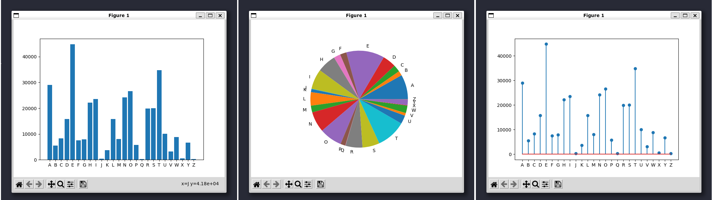

# gutenzahler Testing Report
### Gary Khodayari 13th Mar 2022

[Github Link](https://github.com/d0ntblink/gutenzahler)

## Tests

| ***Function*** | ***Description*** | ***Status*** | ***Example*** |
|:-------------------|:--------------------------------:|:--------------:|----------:|
| --help function | Help funtion assists the user on how the program should be used | *Passed* | [Example](#--help)
| Argument Sanatizing | Wrong arguments are ignore and bad areguments are prompted | *Passed* | [Example](#argument-sanatizing)
| Error | An Error is diplayed for wrong inputs | *Passed* | [Example](#error-prompt)
| Read Local Files | Local files are accepted and processed | *Passed* | [Example](#read-local-files)
| Fetch Gutenberg.org titles | TTitles can be fetched from gutenberg.org and processed | *Passed* | [Example](#fetch-titles-from-gutenberg.org)
| Bar graph | Bar graph is displayed | *Passed* | [Example](#graphs)
| Pie graph | Pie graph is displayed | *Passed* | [Example](#graphs)
| Stem graph | Stem graph is displayed | *Passed* | [Example](#graphs)
| Library import | Libraries are imported properly | *Passed* |
| Program quits properly | program quits after its done | *Passed* |
| Word count is accurte | word count is displayed and is accurate to 4 decimal places | *Passed* | [Example](#word-count)
| Multiple Graphs | Multiple graph options can be selected and processed | *Passed* | [Example](#multigraph)

## Examples

### --help
```
┌──(d0ntblink㉿H0rn3d0wl)-[~/Projects/gutenzahler/Code]
└─$ ./gutenzahler.py --help

gutenzahler is a python program for analyzing english alphabet frequency in a text.

Usage:
to read and analyze a local file:
    gutenzahler.py --read <file format> <file target location>
to read and analyze a book on Gutenberg Corpus:
    gutenzahler.py --fetch <bookid on gutenberg>

NOTE: I highley recommend using the fetch mode as the program will clean up the
text and generate a more accurate resaults

Arguments:
    --help: displays this message
    --read: reads local files
    --fetch: reads titles available on Gutenberg.org
    --pie:  generates a pi graph of the alphabet letters
    --bar: generates a bar graph of the alphabet letters
Accepted file formats:
    txt
    html (WIP)
    epub (WIP)

Example:
    gutenzahler.py --fetch 10010 --bar
    gutenzahler.py --read txt "/home/user/Hansel and Gretel.txt" --pie --bar
    gutenzagler.py --read txt $PWD/lol.txt

invalid arguments!!

gutenzahler is a python program for analyzing english alphabet frequency in a text.

Usage:
to read and analyze a local file:
    gutenzahler.py --read <file format> <file target location>
to read and analyze a book on Gutenberg Corpus:
    gutenzahler.py --fetch <bookid on gutenberg>

NOTE: I highley recommend using the fetch mode as the program will clean up the
text and generate a more accurate resaults

Arguments:
    --help: displays this message
    --read: reads local files
    --fetch: reads titles available on Gutenberg.org
    --pie:  generates a pi graph of the alphabet letters
    --bar: generates a bar graph of the alphabet letters
Accepted file formats:
    txt
    html (WIP)
    epub (WIP)

Example:
    gutenzahler.py --fetch 10010 --bar
    gutenzahler.py --read txt "/home/user/Hansel and Gretel.txt" --pie --bar
    gutenzagler.py --read txt $PWD/lol.txt
```
### Error Prompt
```
┌──(d0ntblink㉿H0rn3d0wl)-[~/Projects/gutenzahler/Code]
└─$ ./gutenzahler.py fdsafsa
invalid arguments!!

gutenzahler is a python program for analyzing english alphabet frequency in a text.

Usage:
to read and analyze a local file:
    gutenzahler.py --read <file format> <file target location>
to read and analyze a book on Gutenberg Corpus:
    gutenzahler.py --fetch <bookid on gutenberg>
```
### Read Local Files
```
┌──(d0ntblink㉿H0rn3d0wl)-[~/Projects/gutenzahler/Code]
└─$ ./gutenzahler.py --read txt $PWD/../Data/67627-0.txt
```
### Fetch Titles From Gutenberg.org
```
┌──(d0ntblink㉿H0rn3d0wl)-[~/Projects/gutenzahler/Code]
└─$ ./gutenzahler.py --fetch 12345

```
### Graphs



### Word Count
```
┌──(d0ntblink㉿H0rn3d0wl)-[~/Projects/gutenzahler/Code]
└─$ ./gutenzahler.py --read txt $PWD/../Data/67627-0.txt --bar --pie --stem
Found 29032 A, that makes it 8.2145% of all the letters found in this text.
Found 5489 B, that makes it 1.5531% of all the letters found in this text.
Found 8308 C, that makes it 2.3507% of all the letters found in this text.
Found 15754 D, that makes it 4.4575% of all the letters found in this text.
Found 44791 E, that makes it 12.6734% of all the letters found in this text.
Found 7532 F, that makes it 2.1311% of all the letters found in this text.
Found 7878 G, that makes it 2.2290% of all the letters found in this text.
Found 22116 H, that makes it 6.2576% of all the letters found in this text.
Found 23562 I, that makes it 6.6668% of all the letters found in this text.
Found 376 J, that makes it 0.1064% of all the letters found in this text.
Found 3676 K, that makes it 1.0401% of all the letters found in this text.
Found 15835 L, that makes it 4.4804% of all the letters found in this text.
Found 7994 M, that makes it 2.2619% of all the letters found in this text.
Found 24174 N, that makes it 6.8399% of all the letters found in this text.
Found 26573 O, that makes it 7.5187% of all the letters found in this text.
Found 5769 P, that makes it 1.6323% of all the letters found in this text.
Found 274 Q, that makes it 0.0775% of all the letters found in this text.
Found 19904 R, that makes it 5.6317% of all the letters found in this text.
Found 19996 S, that makes it 5.6578% of all the letters found in this text.
Found 34810 T, that makes it 9.8493% of all the letters found in this text.
Found 10052 U, that makes it 2.8442% of all the letters found in this text.
Found 3153 V, that makes it 0.8921% of all the letters found in this text.
Found 8796 W, that makes it 2.4888% of all the letters found in this text.
Found 567 X, that makes it 0.1604% of all the letters found in this text.
Found 6677 Y, that makes it 1.8892% of all the letters found in this text.
Found 337 Z, that makes it 0.0954% of all the letters found in this text.
```
### Multigraph
```
┌──(d0ntblink㉿H0rn3d0wl)-[~/Projects/gutenzahler/Code]
└─$ ./gutenzahler.py --read txt $PWD/../Data/67627-0.txt --bar --pie --stem
```